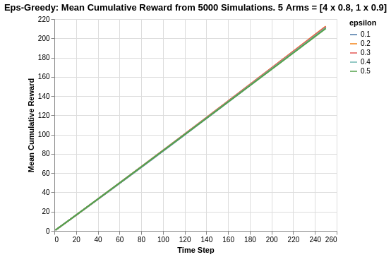

# Analysis of Epsilon Greedy Algorithm

The Epsilon Greedy algorithm is one of the key algorithms behind decision sciences, and embodies the balance of exploration versus exploitation. The dilemma between exploration versus exploitation can be defined simply based on:
- Eploitation: Based on what you know of the circumstances, choose the option/action that has the best average return.
- Exploration: Recognise that what you know of the different options may be limited, and choose to engage in options that may potentially reveal themselves to be of high return

By convention, "epsilon" represents the percentage of time/trials dedicated for exploration, and it is also typical to do random exploration. This introduces some form of stochasticity.

The following analysis is based on the book ["Bandit Algorithms for Website Optimization"](https://www.oreilly.com/library/view/bandit-algorithms-for/9781449341565/) by John Myles White. For further understanding of the code, I have included comments for easier understanding.

Below is the code for creation of the Epsilon Greedy algorithm setup and progressive updates of counts and values for arms.
- Counts: Represent recorded times when arm was pulled.
- Values: Represent the known mean reward. In the case of a Bernoulli arm, values represent the probability of reward which ranges from 0 to 1.

```class EpsilonGreedy():
    def __init__(self, epsilon, counts, values):
        self.epsilon = epsilon
        self.counts = counts # Count represent counts of pulls for each arm. For multiple arms, this will be a list of counts.
        self.values = values # Value represent average reward for specific arm. For multiple arms, this will be a list of values.
        return 
    
    # Initialise k number of arms
    def initialize(self, n_arms):
        self.counts = [0 for col in range(n_arms)]
        self.values = [0.0 for col in range(n_arms)]
        return
    
    # Epsilon greedy arm selection
    def select_arm(self):
        # If prob is not in epsilon, do exploitation of best arm so far
        if random.random() > self.epsilon:
            return np.argmax(self.values)
        # If prob falls in epsilon range, do exploration
        else:
            return random.randrange(len(self.values))
    
    # Choose to update chosen arm and reward
    def update(self, chosen_arm, reward):
        # update counts pulled for chosen arm
        self.counts[chosen_arm] = self.counts[chosen_arm] + 1
        n = self.counts[chosen_arm]
        
        # Update average/mean value/reward for chosen arm
        value = self.values[chosen_arm]
        new_value = ((n-1)/float(n)) * value + (1 / float(n)) * reward
        self.values[chosen_arm] = new_value
        return
```

With the algorithm setup for Espsilon Greedy, we need to discuss the distribution of the arm/action. Think of each arm/action as a coin flip. The outcome of a coin flip is of a dichotomous nature, either Heads or Tails. Thus, we can implement a Bernoulli distribution for each arm. This essentially becomes our Reward information distribution system for each arm.

```
class BernoulliArm():
    def __init__(self, p):
        self.p = p
    
    # Reward system based on Bernoulli
    def draw(self):
        if random.random() > self.p:
            return 0.0
        else:
            return 1.0
        
```
To proceed with any further analysis, an operational script is required to process the simulation. The following code helps to create a simulation for a specific run of epsilon value.
- num_sims: Represents the number of independent simulations, each of length equal to 'horizon'.
- horizon: Represents the number of time steps/trials per round of simulation

```
def test_algorithm(algo, arms, num_sims, horizon):
    
    # Initialise variables for duration of accumulated simulation (num_sims * horizon_per_simulation)
    chosen_arms = [0.0 for i in range(num_sims * horizon)]
    rewards = [0.0 for i in range(num_sims * horizon)]
    cumulative_rewards = [0 for i in range(num_sims * horizon)]
    sim_nums = [0.0 for i in range(num_sims *horizon)]
    times = [0.0 for i in range (num_sims*horizon)]
    
    for sim in range(num_sims):
        sim = sim + 1
        algo.initialize(len(arms))
        
        for t in range(horizon):
            t = t + 1
            index = (sim -1) * horizon + t -1
            sim_nums[index] = sim
            times[index] = t
            
            # Selection of best arm and engaging it
            chosen_arm = algo.select_arm()
            chosen_arms[index] = chosen_arm
            
            # Engage chosen Bernoulli Arm and obtain reward info
            reward = arms[chosen_arm].draw()
            rewards[index] = reward
            
            if t ==1:
                cumulative_rewards[index] = reward
            else:
                cumulative_rewards[index] = cumulative_rewards[index-1] + reward
                
            algo.update(chosen_arm, reward)
    
    return [sim_nums, times, chosen_arms, rewards, cumulative_rewards]
```
## Simulation of Arms with relatively big differences in Means
To finalise the simulation process, we can use the following code with the notable highlights:  
- Create 5 arms, four of which have average reward of 0.1, and the last/best has average reward of 0.9.
- Save simulation output to a tab-separated file
- Create 5000 independent simulations for each epsilon value for a total of 5 epsilon values ranging from 0.1 to 0.5.

The choice for 5000 independent simulations is because we want to determine the average performance. Each simulation might be subject to the stochastic nature/run and the performances might be skewed due to random chance. Thus it is important to run a reasonably high number of simulations to evaluate the average mean/performance.

```
import random

random.seed(1)
# out of 5 arms, 1 arm is clearly the best
means = [0.1, 0.1, 0.1, 0.1, 0.9]
n_arms = len(means)
# Shuffling arms
random.shuffle(means)

# Create list of Bernoulli Arms with Reward Information
arms = list(map(lambda mu: BernoulliArm(mu), means))
print("Best arm is " + str(np.argmax(means)))

f = open("standard_results.tsv", "w+")

# Create simulations for each exploration epsilon value
for epsilon in [0.1, 0.2, 0.3, 0.4, 0.5]:
    algo = EpsilonGreedy(epsilon, [], [])
    algo.initialize(n_arms)
    results = test_algorithm(algo, arms, 5000, 250)
    
    # Store data
    for i in range(len(results[0])):
        f.write(str(epsilon) + "\t")
        f.write("\t".join([str(results[j][i]) for j in range(len(results))]) + "\n")
f.close()
```
Using some data-preprocessing and basic Altair visualisation, we can plot the probability of pulling the best arm for each epsilon value.

<p align="center">

</p>

Note that the epsilon greedy algorithm has asymptotic performance due to its inherent nature of exploration. We can observe that the higher the value of epsilon, the lower its asymptotic performance. For example, for 0.5 epsilon, the asymptotic value is actually 60%. This is broken down to 50% for pure exploitation, and an added 10% due to the random exploration (1/5 chance for the remaining 50% for exploration). Likewise, for 0.1 epsilon, the asymptote is around 92%. This is brokwn down to 90% for pure exploitation, and an added 2% due to random exploration (1/5 chance for remaining 10% for exploration).

Another thing worth noting is the rate of convergence. The higher the rate of exploration, the earlier the algorithm discovers the best arm. This is shown by how rapid the line plots increases (until it hits its asymptote). It is interesting to note that the rate of best-arm-discovery is not linear, as shown by how epsilon 0.1 seems to be exponentially slower compared to the others.

<p align="center">

</p>

Taking another look at the cumulative reward system, within the given time horizon of 250 steps, neither 0.1 nor 0.5 epsilon values are the best performers. The best performer is instead 0.2, which has a combination of fast convergence to best arm exploitation and high asymptote.

At this point, it is worth noting that a good optimisation algorithm should achieve the following:
- Discovering the best arm as early as possible in the time horizon
- Possess a high asymptote of average reward (less exploration when it is not needed).

The abovementioned attributes are often at a tradeoff for the fixed Epsilon Greedy algorithm. An improvement to this can be in the form of an annealing Epsilon Greedy algorithm (which will not be covered in this topic) where the epsilon reduces with time in order to increase the asymptote.

## Simulation of Arms with relatively smaller differences in Means

The previous analysis was a simulation exercise on arms with big differences in reward returns. We extend the analysis to a situation where the arms are relatively closer.

In the following case, we simulate 5 arms, 4 of which have a mean of 0.8 while the last/best has a mean of 0.9.

<p align="center">

</p>

Due to the relatively closer difference in reward means, the algorithm now takes much longer to approach the asymptotic limit. With the given time horizon of 250 steps, it simply was insufficient for the algorithm to discover the best arm as compared to the experiment done in the previous section.

Once again, we also observe that epsilon value of 0.1 takes much longer to discover the best arm compared to the others.

<p align="center">

</p>

Additionally, the cumulative rewards for all epsilon values are much closer in nature so much so that they are indistinguishable. This is probably due to the fact that the reward means of all arms are quite close, and also the fact that within the time horizon, the algorithms have not discovered the best arm yet.

## Limitations of Analysis
The analysis is heavily based on a simulation based experiment where the rewards distributions are assumed to be stationary. In practical real world applications, the reward distributions may shift with time, and the algorithm has to continuously ensure that there is sufficient exploration to rediscover the best arm/action to take. 

Another limitation is that in the real world, the reward information may be delayed or may not be easily tracked. An example could be that the desired reward may only be tracked several actions later in a user journey, and thus the latency in the reward feedback system. Another case could be the desired reward metric is not easily definable (such as company revenue) and it can only be measured by a proxy (CTR). Deploying the algorithm to achieve the desired reward in such a case is limited by how good the reward system is represented by the proxy metric.

## Summary
In this analysis, we have taken a look at the Epsilon Greedy algorithm, and explained the impact of epsilon on the asymptotic reward limit, as well as rate of convergence to the best arm discovery. It should also be noted that the relatively difference in means is a crucial aspect of discovering the best arm. 

One aspect that we did not cover was the parameter of number of arms. It should come naturally to think that with more arms, the algorithm has more options to explore and this will delay the rate of discovery of the best arm, and also causes the algorithm to take a longer time to reach the asymptote.