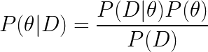
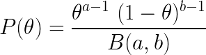
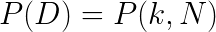
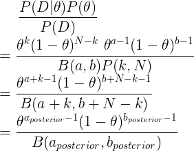
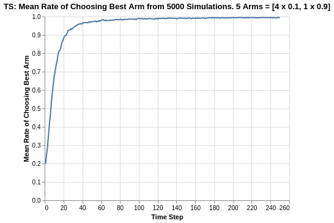
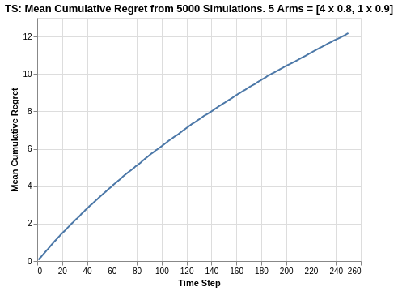

# Analysis of Thompson Sampling Algorithm

The Thompson Sampling algorithm utilises a Bayesian probabilistic approach to modelling the reward distribution of the various arms. As a short summary, Bayes rule is simply formulated as the following:

<p align="center">
    
</p>

where `D` represents the data observed, `P(θ|D)` is our posterior, `P(D|θ)` is the likelihood of observing the data given θ, and `P(θ)` is the prior belief on the distribution of θ.

In our examples, we have assumed that the arms can be modelled as a Bernoulli distribution, with θ_arm representing the parameter of successful reward for each trial. Consequently, for a total of N_arm trials for each arm, and k_arm count of successful rewards, each arm can be represented by a Binomial Distribution parameterised by N_arm, k_arm, and θ_arm. 

<p align="center">
    
</p>

We adopt the Beta distribution as a parametric assumption to model the prior distribution of θ. The beta distribution is a function of `a` and `b`, which represents the counts of success and failures for a given θ. In the context of a prior, it represents the pseudo counts of successful and unsuccessful trials we believe the arm has, which represents our initial perspective of the reward function of the specific arm.

<p align="center">
    
</p>

The denominator of the posterior for each arm represents the distribution of the data, which can be rewritten as some distribution of `k_arm` and `N_arm`.

<p align="center">
    
</p>

By putting everything together, it turns out that the posterior can actually be represented by a Beta distribution parameterised by:
- `a_posterior` = `a_prior + k`
- `b_posterior` = `b_prior + N - k`

For proof of this, consider the following:

<p align="center">
    
</p>

Thus, we assume a Beta distribution for each arm based on its prior parameters and its playthrough history. At each trial iteration, we will randomly sample from the posterior Beta distribution of each arm, and choose the arm which gives the max value for the next round. This allows the Thompson Sampling to balance between exploration and exploitation based on the individual posterior Beta distributions of each arm. Arms that are not explored as often as others will definitely have a wider variance, which creates opportunities for it to be picked based on stochastic sampling.

After selection of the best arm, we will play it and update the playthrough history of that arm (counts of attempts and successful reward). Note that each successful reward count will increase `a_posterior` while each unsuccessful reward count will increase `b_posterior`.

For the purposes of this exercise, we will use a uniform prior distribution as represented by Beta(a = 1, b = 1).

The following analysis is based on the book ["Bandit Algorithms for Website Optimization"](https://www.oreilly.com/library/view/bandit-algorithms-for/9781449341565/) by John Myles White. Although Thompson Sampling was not covered in the book, I created the code for Thompson Sampling using his template for easier reference with respect to the past algorithm articles. For further understanding of the code, I have included comments for easier understanding.

Below is the code for creation of the Thompson Sampling algorithm setup and progressive updates of counts and values for arms.
- Counts: Represent recorded times when arm was pulled.
- Values: Represent the known mean reward. In the case of a Bernoulli arm, values represent the probability of reward which ranges from 0 to 1.

```
from scipy.stats import beta

class ThompsonSampling():
    def __init__(self, counts, values, a, b):
        self.counts = counts # Count represent counts of pulls for each arm. For multiple arms, this will be a list of counts.
        self.values = values # Value represent average reward for specific arm. For multiple arms, this will be a list of values.
        
        # Beta parameters
        self.a = a
        self.b = b
        return

    # Initialise k number of arms
    def initialize(self, n_arms):
        self.counts = [0 for col in range(n_arms)]
        self.values = [0.0 for col in range(n_arms)]

        # Uniform distribution of prior beta (A,B)
        self.a = [1 for arm in range(n_arms)]
        self.b = [1 for arm in range(n_arms)]
        return
    
    # Thompson Sampling selection of arm for each round
    def select_arm(self):
        n_arms = len(self.counts)
        
        # Pair up all beta params of a and b for each arm
        beta_params = zip(self.a, self.b)
        
        # Perform random draw for all arms based on their params (a,b)
        all_draws = [beta.rvs(i[0], i[1], size = 1) for i in beta_params]
        
        # return index of arm with the highest draw
        return all_draws.index(max(all_draws))
    
    # Choose to update chosen arm and reward
    def update(self, chosen_arm, reward):
        # update counts pulled for chosen arm
        self.counts[chosen_arm] = self.counts[chosen_arm] + 1
        n = self.counts[chosen_arm]
        
        # Update average/mean value/reward for chosen arm
        value = self.values[chosen_arm]
        new_value = ((n - 1) / float(n)) * value + (1 / float(n)) * reward
        self.values[chosen_arm] = new_value
        
        # Update a and b
        
        # a is based on total counts of rewards of arm
        self.a[chosen_arm] = self.a[chosen_arm] + reward
        
        # b is based on total counts of failed rewards on arm
        self.b[chosen_arm] = self.b[chosen_arm] + (1-reward)
        
        return
```

As per discussion in previous articles, we will use a Bernoulli distribution to represent the reward function of each arm.

```
class BernoulliArm():
    def __init__(self, p):
        self.p = p
    
    # Reward system based on Bernoulli
    def draw(self):
        if random.random() > self.p:
            return 0.0
        else:
            return 1.0
```
To proceed with any further analysis, an operational script is required to process the simulation where:
- num_sims: Represents the number of independent simulations, each of length equal to 'horizon'.
- horizon: Represents the number of time steps/trials per round of simulation

```
def test_algorithm(algo, arms, num_sims, horizon):
    
    # Initialise variables for duration of accumulated simulation (num_sims * horizon_per_simulation)
    chosen_arms = [0.0 for i in range(num_sims * horizon)]
    rewards = [0.0 for i in range(num_sims * horizon)]
    cumulative_rewards = [0 for i in range(num_sims * horizon)]
    sim_nums = [0.0 for i in range(num_sims *horizon)]
    times = [0.0 for i in range (num_sims*horizon)]
    
    for sim in range(num_sims):
        sim = sim + 1
        algo.initialize(len(arms))
        
        for t in range(horizon):
            t = t + 1
            index = (sim -1) * horizon + t -1
            sim_nums[index] = sim
            times[index] = t
            
            # Selection of best arm and engaging it
            chosen_arm = algo.select_arm()
            chosen_arms[index] = chosen_arm
            
            # Engage chosen Bernoulli Arm and obtain reward info
            reward = arms[chosen_arm].draw()
            rewards[index] = reward
            
            if t ==1:
                cumulative_rewards[index] = reward
            else:
                cumulative_rewards[index] = cumulative_rewards[index-1] + reward
                
            algo.update(chosen_arm, reward)
    
    return [sim_nums, times, chosen_arms, rewards, cumulative_rewards]
```
## Simulation of Arms with relatively big differences in Means
Similar to what was done previous analysis for Epsilon-greedy, the simulation comprises of the following:  
- Create 5 arms, four of which have average reward of 0.1, and the last/best has average reward of 0.9.
- Save simulation output to a tab-separated file
- Create 5000 independent simulations

In this example, since the Thompson Sampling algorithm does not have any hyperparameter (aside from our assumed Beta(1,1) prior), we create a single set of 5000 simulations.

The choice for 5000 independent simulations is because we want to determine the average performance. Each simulation might be subject to the stochastic nature/run and the performances might be skewed due to random chance. Thus it is important to run a reasonably high number of simulations to evaluate the average mean/performance.

```
import random

random.seed(1)
# out of 5 arms, 1 arm is clearly the best
means = [0.1, 0.1, 0.1, 0.1, 0.9]
n_arms = len(means)
# Shuffling arms
random.shuffle(means)

# Create list of Bernoulli Arms with Reward Information
arms = list(map(lambda mu: BernoulliArm(mu), means))
print("Best arm is " + str(np.argmax(means)))

f = open("standard_ts_results.tsv", "w+")

# Create simulations for ThompsonSampling
algo = ThompsonSampling([], [], [], [])
algo.initialize(n_arms)
results = test_algorithm(algo, arms, 5000, 250)
    
# Store data
for i in range(len(results[0])):
    f.write("\t".join([str(results[j][i]) for j in range(len(results))]) + "\n")
f.close()
```
Using some data-preprocessing and basic Altair visualisation, we can plot the probability of pulling the best arm.

<p align="center">

</p>

The Thompson Sampling algorithm shows a relatively quick convergence to the choice of best arm. Within 40 trials, the average rate of choosing the best arm is around 95%. This is extremely impressive compared to the other algorithms we have seen so far. 

At the start, all arms are perceived equally since they all have the same priors. Thus, the rate of choosing the best arm always starts from 20%, which is a random chance of choosing the best arm out of 5 arms. As the trial progresses, the algorithm lets the playthrough history of the arms take over, and it quickly identifies the best arm with each update of the posterior Beta distribution. Note that the progression is also smooth as compared to what we observed in the UCB1 algorithm.

There does not seem to be any asymptote limit in terms of the performance, as the plot continues to converge towards 100% chance of choosing the best arm with progression in the trial.

<p align="center">

</p>

Given that the Thompson Sampling algorithm manages to identify the choice of best arm early on, it starts accumulating rewards quickly. By the end of the time horizon of 250 steps, it reaches about 215 cumulative points on average, which means it outpeforms almost all the other algorithms such as Epsilon Greedy, Softmax and UCB1 (except Softmax `tau` = 0.1 which had about 218).

Similar to what we saw in UCB1, there is a slight curvature in the cumulative reward plot in the early phases of the trial. This is quickly straightened out as a straight line (which should approximate 0.9 as per the reward average of the best arm).

## Simulation of Arms with relatively smaller differences in Means

The previous analysis was a simulation exercise on arms with big differences in reward returns. We extend the analysis to a situation where the arms are relatively closer.

In the following case, we simulate 5 arms, 4 of which have a mean of 0.8 while the last/best has a mean of 0.9.

<p align="center">

</p>

For this experiment with a reduced difference between the reward returns of all arms, the Softmax and UCB algorithms both experienced severe deterioration as their rate of choosing the best arm dropped to the ranges of 0.20 to 0.30. However, for Thompson Sampling, the rate of choosing the best arm now approaches 0.68, which is the best result so far (even compared to Eps-Greedy `epsilon` = 0.2 which was about 0.65).

Although there does seem to be some form of reduction in the gradient as the experiment progresses, it does not seem like there is a hard asymptote for the plot. My postulation is that with a longer time horizon, the Thompson Sampling algorithm will continue to increase towards 100%. 

<p align="center">

</p>

Since the arms are close in average returns, it will be more interesting to verify the overall cumulative regret. 

<p align="center">

</p>

We observe that Thompson Sampling is the best performer with a cumulative regret of 12.1. This is much more superior compared to the UCB1 and Softmax algorithm, while also slightly edging out the best of Epsilon Greedy algorithm (which had a range of 12.3 to 14.8). With the relatively high tapering off in the plot, this can explain why the Thompson Sampling outperforms the other algorithms.

## Summary
In this analysis of Thompson Sampling algorithm, we started off with the Baye's Rule and used a parametric assumption of Beta distributions for the priors. The overall posterior for each arm's reward function was a combination of Binomial likelihood and Beta prior, which could be represented as another Beta distribution. 

Compared to the other algorithms, the Thompson Sampling algorithm provides robustness in performance regardless of arms with close reward averages and arms with big difference in reward averages.