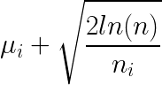
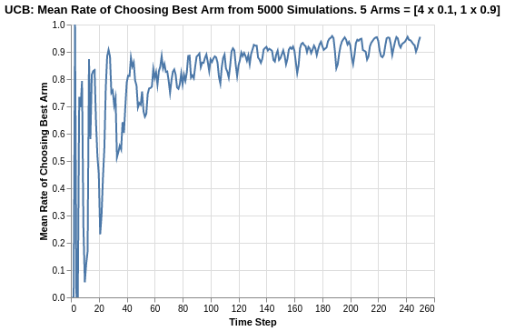
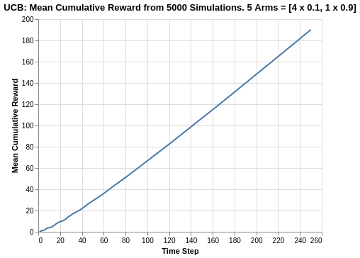
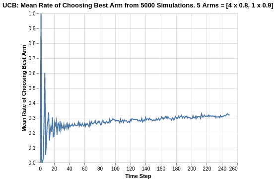

# Analysis of Upper Confidence Bound (1) Algorithm

The Upper Confidence Bound (UCB) algorithm is often phrased as "optimism in the face of uncertainty". To understand why, consider at a given round that each arm's reward function can be perceived as a point estimate based on the average rate of reward as observed. Drawing intuition from confidence intervals, for each point estimate, we can also incorporate some form of uncertainty boundary around the point estimate. In that sense, we have both lower boundary and upper boundary for each arm. 

The UCB algorithm is aptly named because we are only concerned with the upper bound, given that we are trying to find the arm with the highest reward rate.

There are different variants of the UCB algorithms but in this article, we will take a look at the UCB1 algorithm. At each given round of `n` trials, the reward UCB of all arms are represented by the following:

<p align="center">
    
</p>

where `mu_i` represents the current reward return average of arm _i_ at the current round, `n` represents the number of trials passed, and `n_i` represents the number of pulls given to arm _i_ in the playthrough history.

The above formulation is simple but yet has several interesting implications as explained in the following:
- The upper boundary is proportional to the squared root of `ln(n)`, which means that when the experiment progresses, all arms have their upper boundaries increases by a factor of squared root of `ln(n)`. 
- This upper boundary is inversely proportional to the squared root of `n_i`. The more times the specific arm has been engaged before in the past, the greater the confidence boundary reduces towards the point estimate. 

Thereafter, the UCB algorithm always picks the arm with the highest reward UCB as represented by the equation above. 

Beyond the formulation explanation, here is a simple thought experiment to glean some intuition on how UCB algorithm incorporates exploration and exploitation. 

The time complexity between the numerator and denominator provides a tension between exploration and exploitation. For any increase in `n`, the UCB increases only by logarithmic time, while for any increase in `n_i`, the UCB decreases by `n_i`. Thus, an arm that has not been explored as often as other arms will have a bigger UCB component. Depending on its current average mean, the overall UCB function representation of that specific arm may be greater than other arms with higher return but smaller components, and consequently enable that arm to be picked.

The following analysis is based on the book ["Bandit Algorithms for Website Optimization"](https://www.oreilly.com/library/view/bandit-algorithms-for/9781449341565/) by John Myles White. For further understanding of the code, I have included comments for easier understanding.

Below is the code for creation of the UCB1 algorithm setup and progressive updates of counts and values for arms.
- Counts: Represent recorded times when arm was pulled.
- Values: Represent the known mean reward. In the case of a Bernoulli arm, values represent the probability of reward which ranges from 0 to 1.

```
class UCB1():
    def __init__(self, counts, values):
        self.counts = counts # Count represent counts of pulls for each arm. For multiple arms, this will be a list of counts.
        self.values = values # Value represent average reward for specific arm. For multiple arms, this will be a list of values.
        return

    # Initialise k number of arms
    def initialize(self, n_arms):
        self.counts = [0 for col in range(n_arms)]
        self.values = [0.0 for col in range(n_arms)]
        return
    
    # UCB arm selection based on max of UCB reward of each arm
    def select_arm(self):
        n_arms = len(self.counts)
        for arm in range(n_arms):
            if self.counts[arm] == 0:
                return arm
    
        ucb_values = [0.0 for arm in range(n_arms)]
        total_counts = sum(self.counts)
        
        for arm in range(n_arms):
            bonus = math.sqrt((2 * math.log(total_counts)) / float(self.counts[arm]))
            ucb_values[arm] = self.values[arm] + bonus
        return ucb_values.index(max(ucb_values))
    
    # Choose to update chosen arm and reward
    def update(self, chosen_arm, reward):
        self.counts[chosen_arm] = self.counts[chosen_arm] + 1
        n = self.counts[chosen_arm]
        
        # Update average/mean value/reward for chosen arm
        value = self.values[chosen_arm]
        new_value = ((n - 1) / float(n)) * value + (1 / float(n)) * reward
        self.values[chosen_arm] = new_value
        return
```

As per discussion in previous articles, we will use a Bernoulli distribution to represent the reward function of each arm.

```
class BernoulliArm():
    def __init__(self, p):
        self.p = p
    
    # Reward system based on Bernoulli
    def draw(self):
        if random.random() > self.p:
            return 0.0
        else:
            return 1.0
```
To proceed with any further analysis, an operational script is required to process the simulation where:
- num_sims: Represents the number of independent simulations, each of length equal to 'horizon'.
- horizon: Represents the number of time steps/trials per round of simulation

```
def test_algorithm(algo, arms, num_sims, horizon):
    
    # Initialise variables for duration of accumulated simulation (num_sims * horizon_per_simulation)
    chosen_arms = [0.0 for i in range(num_sims * horizon)]
    rewards = [0.0 for i in range(num_sims * horizon)]
    cumulative_rewards = [0 for i in range(num_sims * horizon)]
    sim_nums = [0.0 for i in range(num_sims *horizon)]
    times = [0.0 for i in range (num_sims*horizon)]
    
    for sim in range(num_sims):
        sim = sim + 1
        algo.initialize(len(arms))
        
        for t in range(horizon):
            t = t + 1
            index = (sim -1) * horizon + t -1
            sim_nums[index] = sim
            times[index] = t
            
            # Selection of best arm and engaging it
            chosen_arm = algo.select_arm()
            chosen_arms[index] = chosen_arm
            
            # Engage chosen Bernoulli Arm and obtain reward info
            reward = arms[chosen_arm].draw()
            rewards[index] = reward
            
            if t ==1:
                cumulative_rewards[index] = reward
            else:
                cumulative_rewards[index] = cumulative_rewards[index-1] + reward
                
            algo.update(chosen_arm, reward)
    
    return [sim_nums, times, chosen_arms, rewards, cumulative_rewards]
```
## Simulation of Arms with relatively big differences in Means
Similar to what was done previous analysis for Epsilon-greedy, the simulation comprises of the following:  
- Create 5 arms, four of which have average reward of 0.1, and the last/best has average reward of 0.9.
- Save simulation output to a tab-separated file
- Create 5000 independent simulations

In this example, since the UCB algorithm does not have any hyperparameter, we create a single set of 5000 simulations.

The choice for 5000 independent simulations is because we want to determine the average performance. Each simulation might be subject to the stochastic nature/run and the performances might be skewed due to random chance. Thus it is important to run a reasonably high number of simulations to evaluate the average mean/performance.

```
import random

random.seed(1)
# out of 5 arms, 1 arm is clearly the best
means = [0.1, 0.1, 0.1, 0.1, 0.9]
n_arms = len(means)
# Shuffling arms
random.shuffle(means)

# Create list of Bernoulli Arms with Reward Information
arms = list(map(lambda mu: BernoulliArm(mu), means))
print("Best arm is " + str(np.argmax(means)))

f = open("standard_ucb_results.tsv", "w+")

# Create 1 round of 5000 simulations
algo = UCB1([], [])
algo.initialize(n_arms)
results = test_algorithm(algo, arms, 5000, 250)
    
# Store data
for i in range(len(results[0])):
    f.write("\t".join([str(results[j][i]) for j in range(len(results))]) + "\n")
f.close()
```
Using some data-preprocessing and basic Altair visualisation, we can plot the probability of pulling the best arm.

<p align="center">

</p>

The UCB algorithm has extreme fluctuations in its rate of choosing the best arm in the early phases of the experiment as shown by time steps between 0 to 60. This can be explained by the emphasis of exploration amongst all arms since the UCB components for all arms are much bigger at the start. 

As the trial progresses, the UCB components becomes much smaller for all arms, and the UCB function representation of each arm converges towards the average reward mean of each arm. Thus, the arm with the higher mean becomes more distinguishable by the algorithm and becomes more frequently picked as the trial progresses. Thus, we observe that the rate of choosing the best arm does not seem to have a hard asymptote, but converges towards 1. The rate of convergence towards 1 slows down as it approaches 1, and the experiment time horizon was too short for us to observe any further convergence. 

<p align="center">

</p>

The cumulative reward plot of the UCB algorithm is comparable to the other algorithms. Although it does not do as well as the best of Softmax (`tau` = 0.1 or 0.2) where the cumulative reward was beyond 200, the UCB cumulative reward range is close to that range (around 190).

We also observe some form of curvature in the early phases of the trial, which can be corroborated by the extreme fluctuations we saw in the rate of choosing best arms. Likewise, when the experiment progresses, the algorithm can distinguish the best arm, and picks it with higher frequency, and the cumulative reward plot has a straight line gradient (which should approximate a value of 0.9 based on consistently choosing the best arm).

## Simulation of Arms with relatively smaller differences in Means

The previous analysis was a simulation exercise on arms with big differences in reward returns. We extend the analysis to a situation where the arms are relatively closer.

In the following case, we simulate 5 arms, 4 of which have a mean of 0.8 while the last/best has a mean of 0.9.

<p align="center">

</p>

Based on a reduced difference between the reward returns of all arms, we observe a big deterioration in the performance of the UCB algorithm. The rate of choosing the best arm now approaches 0.32, which is similar to what we saw in the Softmax algorithm.

Drawing parallels with the Softmax algorithm, this seems to imply that the reduced difference in reward function makes it harder to determine which is the best arm. Note that random chance of picking the best arm in this case is 1 in 5 or 0.20.

It should be noted that in this scenario, for Epsilon Greedy algorithm, the rate of choosing the best arm is actually higher as represented by the ranges of 0.5 to 0.7. This also seems to imply that Epsilon Greedy might be better suited for multi-armed based situations where the difference in means are much smaller as compared to UCB or Softmax algorithm.

<p align="center">

</p>

Since the arms are close in average returns, the eventual UCB cumulative reward obtains a value of around 210. Compare this to choosing the best arm which will return 0.9 * 250 = 225, we see a regret of 15. It might seem small in this case, but as a percentage, it can be considered as significant (6.67%) depending on the application focus.

Taking a look at the overall cumulative regret may provide a better perspective of the performance, especially with respect to the other algorithms.

<p align="center">

</p>

Based on the cumulative regret plots, we see that UCB1 has a cumulative regret of 18, which is similar to the Softmax algorithm. It is also worst off compared to the Epsilon Greedy algorithm which had a range of 12.3 to 14.8. The cumulative regret line is also relatively straight, which means that the algorithm will continue to accumulate more regret with a longer time horizon.

## Summary
In this analysis of UCB algorithm, we broke down the formulation of the algorithm and also performed simulation experiments for different arms to illustrate its robustness (or lack thereof).

Similar to the Softmax algorithm, a learning takeaway is that for arms with closer means, the UCB algorithm does not seem to be as robust in terms of determining the best arm, for which Epsilon Greedy is more suitable. 