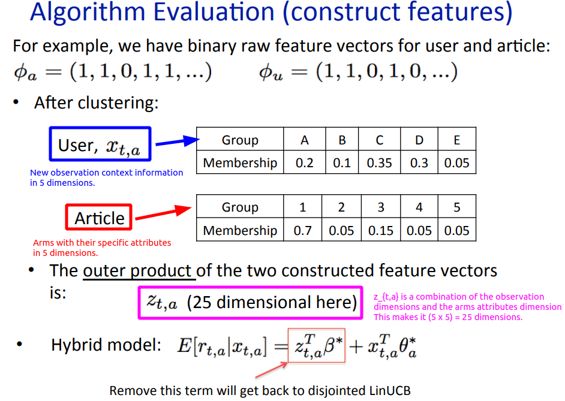
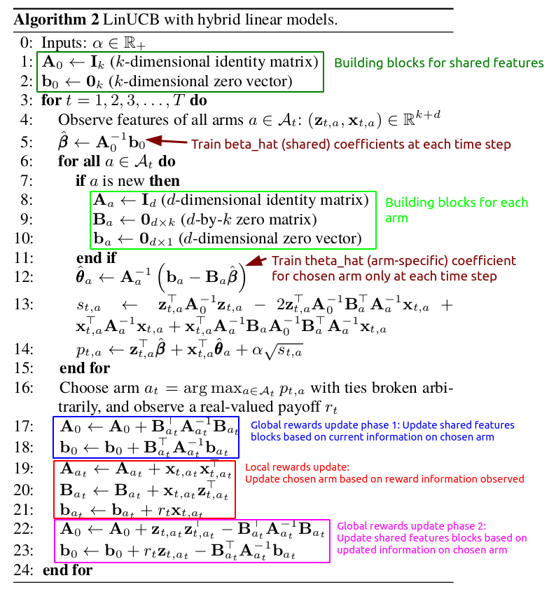
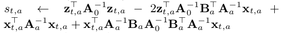
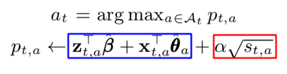
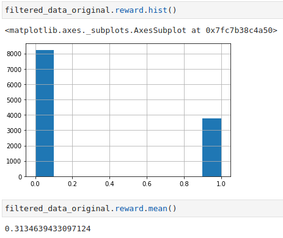
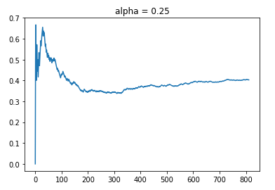
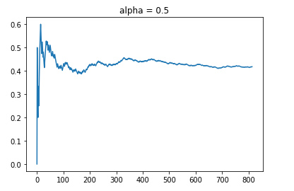
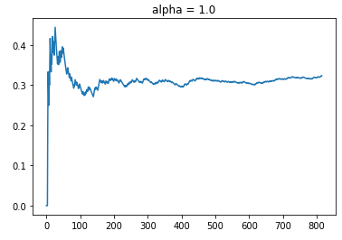
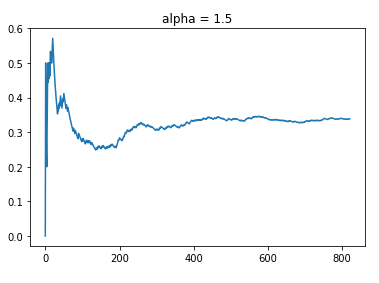
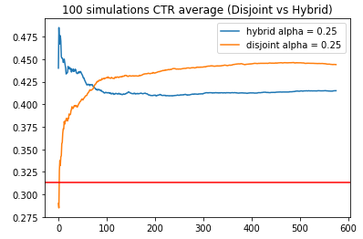

# Contextual Bandits: Linear Upper Confidence Bound Hybrid (LinUCB Hybrid) Algorithm with MovieLens Dataset

In my previous [post](https://github.com/kfoofw/bandit_simulations/blob/master/python/contextual_bandits/analysis/linUCB%20disjoint%20implementation%20and%20analysis.md), I explained the background behind contextual bandits (CB) as a variant of the multi-armed bandit (MAB) problems that utilises contextual information. With a summary introduction to the upper confidence bound (UCB) algorithm in MAB applications,  I extended the use of that concept in contextual bandits by diving into a detailed implementation of the linear upper confidence bound disjoint (LinUCB Disjoint) contextual bandits. 

The LinUCB Disjoint is based on the concept that the reward rate of each arms are a linear function of its covariates as shown in the following equation:

<div align="center">
    
</div>

This comes with the implicit assumption that the arms are distinct from each other, and do not have shared features, which is why they are considered "disjointed".

# LinUCB Hybrid

However, in certain applications, one may consider that the arms are not mutually exclusive in their properties. For example, in a news recommendation system where the articles are arms that is recommended to users (with their own context) to obtain engagement. Some articles may be similar to each other, and therefore have shared features. 

Consider 3 articles wherein the first two are sports related and the third is science fiction, it is more likely that users who like the first sports article will prefer the 2nd sports article compared to the science fiction article.

This brings us to the concept of LinUCB hybrid with Hybrid Linear Models (LinUCB Hybrid) algorithm which was discussed in the paper ["A Contextual-Bandit Approach to Personalized News Article Recommendation"](https://arxiv.org/abs/1003.0146). The hybrid model states that the reward payoff of each arm is a linear function of __shared and non-shared__ components as shown by:

<div align="center">
    
</div>

where:
- `x_{t,a}` represents the contextual information of the new observation data (as per what we saw in the LinUCB Disjoint algorithm)
- `z_{t,a}` represents the combination of arm features and contextual attributes. If we removed this, the algorithm reverts back to LinUCB Disjoint.

It might be confusing to envision what `z_{t,a}` is about. In the lecture notes by Caltech Assoc Prof Yue Yisong (which can be found [here](http://www.yisongyue.com/courses/cs159/lectures/LinUCB.pdf)), it puts forth the notion that each arm has its own attributes, and we create a profile for all arms under the attributes dimensions. Based on these attributes, it is possible to identify the similarity or dissimilarity between arms.

<div align="center">
    
</div>

By using both the dimensions of the observation context information `x_t` and the specific attributes for each arm, we can create `z_{t,a}` as an outer product of those two pieces of information. Note that since each arm has its own specific attributes, this results in different `z` arrays for each arm for a given `x_t`.

In the linear model equation, just as `x_{t,a}` has its corresponding coefficients `θ*_a`, `z_{t,a}` also has its corresponding coefficients `β*`. The main difference is that while `θ*_a` is arm specific (which is explained by its notation subscript `a`), `β*` is for all arms and is located as part of the policy. This intuition is captured in the algorithm steps, where the reward information is used to update for a chosen arm. As such, the chosen arm gets to update its coefficients `θ*_a` with `x_{t,a}`, but at the same time, the policy updates `β*` too. 

Simply put, in the Disjoint algorithm, we only update information about chosen arms in terms of their reward payoff as a linear function of contextual information. In the Hybrid algorithm, we update information not just for chosen arms, but also update how the reward payoff changes with arm features that may be common.

To see how having shared attributes/features across arms help, let's think about the previous example of 3 articles (2 sports and 1 science-fiction). 

For each time step, we have one user's worth of interaction and thus only one unit of reward for the chosen arm/article. Assuming in the next time step, the first sports article is chosen and we calculate `z_{t,a}` as an outer product using `x_{t,a}` and its arm attributes. We observe the reward function and calculate `θ*_a` for the 1st sports article, and also calculate `β*`. Since we are postulating that the two sports articles are similar in terms of shared arm attributes, it is a reasonable assumption that their `z_{t,a}` array values will be similar. 

__In that sense, with the inclusion of `z_{t,a}` to extract out `β*`, we are able to update information about the reward payoff for similar sports articles/arms, even though the reward was only observed for one sports article.__

# LinUCB Hybrid Algo

The algorithm for LinUCB Hybrid is shown in the following with some comments on the subroutines.

<div align="center">
    
</div>

As mentioned previously, `z_{t,a}` is the outer product of both `x_t` and the arm attributes. For algorithm implementation purposes, `k` represents the combinatorial dimension of `x_t` and arm attributes. 

In this case, we have `A_node` and `b_node` as building blocks for shared features in addition to what we had with `A_a` and `b_a` as building blocks for each arm. We also have another building block called `B_a` which is a building block specific to each arm, and it captures the use of shared features information (as indicated by the k dimensions).

Accounting for the UCB aspect of it, we have the standard deviation of each arm at a given time `s_{t,a}` based on this:

<div align="center">
    
</div>

For a given set of `x_{t,a}` at time `t`, the core of the UCB algorithm arm selection in the Hybrid model is represented by the following:

<div align="center">
    
</div>

In similar form, this is once again represented by picking the arm based on the sum of :
- The mean reward estimate of each arm using both shared and non-shared components (blue box). As mentioned previously, `β*` represents the shared components. Unlike `θ*_a`, `β*` was trained based on all time steps such that arms with similar attributes will tend to capture similar reward structure.
- The corresponding confidence bound (red box), where `α` is a hyper parameter.

Similar to what we discussed in LinUCB, the higher `α` is, the wider the confidence bounds become. Thus it results in a higher emphasis placed on exploration instead of exploitation. 

The algorithm can be broken down into the following phases for each time step `t` with the corresponding context vector `x_t`:
- If the policy is new, initiate `A_node` (k x k identity matrix) and `b_node` (k by 1 zero vector). k represents the combinatorial dimensions using context information and arm attributes.
- Within the policy, if any arm is new, initiate `A_a` (d x d identity matrix), `b_a` (d by 1 zero vector), and `B_a` (d x k zero matrix). d represents the dimensions of the covariates.
- At each time step, calculate `β_hat` using inverse `A_node` and `b_node`. 
- Calculate `θ_hat_a` using the ridge regression formula 
- Using `x_t`, determine `z_{t,a}` first and calculate the UCB of each arm based on the sum of the expected mean and confidence bound (`alpha` * standard deviation)
- Out of all arms, select the arm that has the highest UCB. If there are arms that have the same UCB, randomly pick between them.
- Observe the reward based on the selected arm at time step `t`
- Update shared building blocks `A_node` & `b_node` based on chosen arm's `A_{a,t}`, `B_{a,t}` & `b_{a,t}`.
- Update reward information for chosen arm's building blocks `A_{a,t}`, `B_{a,t}` & `b_{a,t}`.
- Update shared building blocks `A_node` & `b_node` using reward, `z_{t,a}` and chosen arm's building blocks.

The above explanation captures most of the required intuition in the implementation of the LinUCB, while skipping certain technical details of it. Do refer to the actual paper for a deeper dive into it. 

# LinUCB Disjoint Implementation in Python

For a quick reference to the Jupyter notebook in this section, please refer to the link [here](https://github.com/kfoofw/bandit_simulations/blob/master/python/contextual_bandits/notebooks/LinUCB_hybrid.ipynb).

In summary, we need 3 objects for the simulation:
- Class object for each LinUCB hybrid arm
- Class object for the policy of K number of LinUCB hybrid arms
- Function for simulating the policy using a data set to determine the cumulative takeoff rate (ctr) using the LinUCB hybrid policy

To implement the algorithm in Python code, we just need `numpy` for the matrix calculations. Along with each code chunk, I added comments to make it more understandable in terms of the algorithm.

## LinUCB Hybrid Arm Class Object

Here is the Class object for a single LinUCB Hybrid Arm, which has 4 main methods:
- __Initiation__: Create `A`, `B`, `b` for that arm
- __Initiate arm features__: To specify the attributes of each arm as well as the corresponding arm index that is found in the data set.
- __UCB Calculation__: Taking `x_t` context, `A_node_inv` & `beta_hat` as inputs at time t, we determine the estimate of `θ_hat`. Subsequently, we calculate the UCB.
- __Reward update__: Update information for that arm if it was chosen with the observed reward.

```{python}
# Create class object for a single linear ucb hybrid arm
class linucb_hybrid_arm():
    # Note that shared features coefficients beta_hat is calculated outside of each arm since 
    # it is about shared features across individual arms
    
    def __init__(self, d, k, alpha):
        
        # Arm specific A: (d * d) matrix = D_a.T * D_a + I_d. 
        # The inverse of A is used in ridge regression 
        self.A = np.identity(d)
        
        # B: (d * k) matrix
        # Equals to D_a.T * c_a in ridge regression formulation
        self.B = np.zeros([d, k])
        
        # b: (d * 1) corresponding response vector. 
        # Equals to D_a.T * c_a in ridge regression formulation
        self.b = np.zeros([d,1])
        
        # Alpha hyperparam
        self.alpha = alpha
        
    def init_arm_features(self, arm_index, arm_features_array):
        # Track arm_index
        self.index = arm_index
        
        # arm_features to be used with x_array using outer product to find individual arm z_features
        self.arm_features = arm_features_array
        
        
    def calc_UCB(self, x_array, A_node_inv, beta_hat):
        # beta_hat is the coefficients for Z shared features. (k * 1) vector
        # A_node_inv is (k * k) matrix that is inverse for A_node (shared features)
        
        # Create arm specific z_array with x_array and self.arm_features
        # z_array elements is based on the combination of user and movie features, which is the outer product of both arrays
        # z_array = Outer product = (19 * 29) or (k by d) matrix
        z_array = np.outer(self.arm_features, x_array).reshape(-1,1)
        
        # Find inverse of arm-specific A
        A_inv = np.linalg.inv(self.A)
        
        # Find theta_arm with beta_hat input
        self.theta = np.dot(A_inv, (self.b - np.dot(self.B, beta_hat)))
        
        # std deviation
        s = np.dot(z_array.T, np.dot(A_node_inv, z_array)) \
            - 2 * np.dot(z_array.T, np.dot(A_node_inv, np.dot(self.B.T, np.dot(A_inv, x_array)))) \
            + np.dot(x_array.T, np.dot(A_inv, x_array)) \
            + np.dot(x_array.T, np.dot(A_inv, np.dot(self.B, np.dot(A_node_inv, np.dot(self.B.T, np.dot(A_inv, x_array))))))
        
        
        # UCB
        p = np.dot(z_array.T, beta_hat) + np.dot(x_array.T, self.theta) + self.alpha*np.sqrt(s)
        
        return p
    
    def reward_update(self, reward, x_array, z_array):
        
        # Update A which is (d * d) matrix.
        self.A += np.dot(x_array, x_array.T)
        
        # Update B which is (d * k) matrix.
        self.B += np.dot(x_array, z_array.T)
        
        # Update b which is (d * 1) vector
        # reward is scalar
        self.b += reward * x_array                          
```
## LinUCB Hybrid Policy Class Object

Here is the Class object for the LinUCB hybrid policy for K number of arms. It has five main methods:
- __Initiation__: Create a list of K `linucb_hybrid_arm` objects, along with initiation of `A_node` and `b_node` as building blocks for shared features.
- __Store Arm Features__: Given K number of arm features array, update all arms with their attributes.
- __Arm selection__: Choose arm based on the arm with the highest UCB for a given time step. 
- __Shared features update phase 1__: Update shared features building blocks with chosen arm before reward information update is done for that arm.
- __Shared features update phase 2__: Update shared features building blcoks with chosen arm after reward information update is done for that arm.

```{python}
class linucb_hybrid_policy():
    
    def __init__(self, K_arms, d, k, alpha):
        self.K_arms = K_arms
        self.linucb_arms = [linucb_hybrid_arm(d = d, k = k, alpha = alpha) for i in range(K_arms)]
        
        # shared A_node: (k * k) matrix
        self.A_node = np.identity(k)
        
        # shared b_node: (k * 1) corresponding response vector. 
        self.b_node = np.zeros([k,1])
        
    def store_arm_features(self, arms_features_array):
        # Arms_features_array is multidimension array of shape (K_arms, 1+arm_dimensions), where 1 is for arm_index
    
        # Loop through all arms to store the individual arms
        for i in range(self.K_arms):
        
            self.linucb_arms[i].init_arm_features(arm_index = arms_features_array[i,0], 
                                                  arm_features_array = arms_features_array[i,1:])
        
    def select_arm(self, x_array):
        # Initiate ucb to be 0
        highest_ucb = -1
        
        # Create inverse of A_node to be fed in
        A_node_inv = np.linalg.inv(self.A_node)
        
        
        # Calc beta_hat using A_node_inv and b_node.
        # (k * 1) vector
        beta_hat = np.dot(A_node_inv, self.b_node)
        
        # Track index of arms to be selected on if they have the max UCB.
        candidate_arms = []
        
        for arm_index in range(self.K_arms):
            # Calculate ucb based on each arm using current covariates at time t
            arm_ucb = self.linucb_arms[arm_index].calc_UCB(x_array, A_node_inv, beta_hat)
            
            # If current arm is highest than current highest_ucb
            if arm_ucb > highest_ucb:
                
                # Set new max ucb
                highest_ucb = arm_ucb
                
                # Reset candidate_arms list with new entry based on current arm
                candidate_arms = [arm_index]

            # If there is a tie, append to candidate_arms
            if arm_ucb == highest_ucb:
                
                candidate_arms.append(arm_index)
        
        # Choose based on candidate_arms randomly (tie breaker)
        chosen_arm_index = np.random.choice(candidate_arms)
        
        return chosen_arm_index
    
    def update_shared_features_matrices_phase1(self, chosen_arm_B, chosen_arm_A, chosen_arm_b):
        # Use chosen arm's B (d*k), A(d*d), b(k*1) for update of shared feature matrices
        
        chosen_arm_A_inv = np.linalg.inv(chosen_arm_A)
        
        self.A_node += np.dot(chosen_arm_B.T, np.dot(chosen_arm_A_inv, chosen_arm_B))
        self.b_node += np.dot(chosen_arm_B.T, np.dot(chosen_arm_A_inv, chosen_arm_b))
        
    def update_shared_features_matrices_phase2(self, z_array, reward, chosen_arm_B, chosen_arm_A, chosen_arm_b):
        
        chosen_arm_A_inv = np.linalg.inv(chosen_arm_A)
        
        self.A_node += np.dot(z_array, z_array.T) - np.dot(chosen_arm_B.T, np.dot(chosen_arm_A_inv, chosen_arm_B)) 
        self.b_node += reward * z_array - np.dot(chosen_arm_B.T, np.dot(chosen_arm_A_inv, chosen_arm_b))
    
```
## MovieLens Dataset and CTR Simulator

I tried looking for the dataset that was used in the paper ["A Contextual-Bandit Approach to Personalized News Article Recommendation"](https://arxiv.org/abs/1003.0146), but I couldn't get access to it on [Yahoo Labs](https://webscope.sandbox.yahoo.com/catalog.php?datatype=r&guccounter=1). Thus, I decided to use an alternate dataset with some modifications.

For the data set, we will use the MovieLens dataset from [here](http://files.grouplens.org/datasets/movielens/). To be more specific, I will be looking at the [100K variant of the data set](http://files.grouplens.org/datasets/movielens/ml-100k-README.txt). The data set has 3 main tables of interest:
- __Users data__: User ID with corresponding user information such as age, gender, occupation, zipcode.
- __Movies data__: Information about movies based on their genres. Movies will represent the arms in this experiment. Thus, their genres will represent the attributes of the arms.
- __User Movie Ratings__: This shows how users react to the different movies as represented by the ratings (1 to 5). 

For this experiment, I will take the perspective of using contextual bandits in a recommender system. __For each encountered user (and their contextual information), the policy will recommend the best movie (which are treated as arms), and observe the reward that will be used for online learning in order to recommend better movies.__ 
- The reward is defined to be 1 if the user's rating for a movie is 5, and 0 otherwise (4 or below). 
- I will use the top 30 movies in terms of number of user ratings.

Here's a short summary of the preprocessing I did to obtain both context (user) features and arms (movies) attributes:
- For users, I created age group buckets ('<20', '20-29', '30-39','40-49', '51-60', '60+'). I subsequently created one-hot encoding for "agegroups", "gender" and "occupation". Although "zipcode" is probably very useful, I decided not to use it as I did not know how to properly encode a good relationship across zipcode groups.
- For Movies features, it was simply left as it is in terms of "genres".
- For ratings data, I created the binary reward label based on the condition that the ratings must be 5 to have a reward of 1.
- I only filtered the ratings data to include only the top 30 movies.
- I also performed randomisation of the data order such that it simulates the online learning environment.

Similar to what we did in the LinUCB disjoint analysis, we only choose to observe the reward and perform online learning IF AND ONLY IF our policy selects the same arm as the logged data at that particular time step. Otherwise, we will move on to the next time step without any updates. Implicitly, this requires the assumption that the data points for the different time steps are independent of each other. For time steps in which the above is true, I term them as "aligned time steps". For more details on this methodology, please refer to the paper ["Unbiased Offline Evaluation of Contextual-bandit-based News Article Recommendation Algorithms"](https://arxiv.org/abs/1003.5956) by Li et al. 

A problem with this is that we will probably get very few aligned time steps out of the data. Thus, I decided to __recycle only unused observations__ over repeated epochs, such that we can investigate how the hybrid policy plays out in a longer run.

Here is the function for ctr simulation using the `linucb_hybrid_policy` object for a given data input. This function governs the update of the reward observation IF AND ONLY IF the selected arm by the policy object is equivalent to the arm of the logged data set for that particular time step. As mentioned, it also recycles unused data in epochs.

The function was designed to return the a dictionary object comprising of the following:
- Count of aligned time steps
- Cumulative rewards
- Progression log of CTR during aligned time steps
- LinUCB hybrid policy object

```{python}
def ctr_simulator(K_arms, d, k, alpha, epochs, top_movies_index, top_movies_features, steps_printout):
    # Initiate policy
    linucb_hybrid_policy_object = linucb_hybrid_policy(K_arms = K_arms, d = d, k = k, alpha = alpha)
    
    # Store arm specific features
    linucb_hybrid_policy_object.store_arm_features(top_movies_features.to_numpy())
    
    # Instantiate trackers
    aligned_time_steps = 0
    cumulative_rewards = 0
    aligned_ctr = []
    unaligned_ctr = [] # for unaligned time steps
    
    for epoch_iter in range(epochs):
        
        print("Epoch: " + str(epoch_iter))
        
        if epoch_iter == 0:
            # Start with filtered data first
            data = filtered_data.copy()
            # Initiate unused_data df
            unused_data = pd.DataFrame(columns = ["user_id", "movie_id","rating","reward"])
        else:
            
            # Recycle unused data
            data = unused_data.copy().reset_index(drop = True)
            # Initiate unused_data df
            unused_data = pd.DataFrame(columns = ["user_id", "movie_id","rating","reward"])
        
        for i in range(len(data)):

            user_id = data.loc[i,"user_id"]
            movie_id = data.loc[i, "movie_id"]

            # x_array: User features
            data_x_array = np.array(user_features.query("user_id == @user_id").drop("user_id", axis = 1)) # Shape (1 * 29), d = 29
            data_x_array = data_x_array.reshape(29,1)

            # Obtain rewards
            data_reward = data.loc[i, "reward"]

            if i%steps_printout == 0:
                print("step "+str(i))

            # Find policy's chosen arm based on input covariates at current time step
            chosen_arm_index = linucb_hybrid_policy_object.select_arm(data_x_array)


            # Check if arm_index is the same as data_arm (ie same actions were chosen)
            # Note that data_arms index range from 1 to 10 while policy arms index range from 0 to 9.
            if linucb_hybrid_policy_object.linucb_arms[chosen_arm_index].index  == movie_id:


                # Phase 1: Update shared feature matrices A_node, b_node in policy object
                linucb_hybrid_policy_object.update_shared_features_matrices_phase1(linucb_hybrid_policy_object.linucb_arms[chosen_arm_index].B,
                                                                                   linucb_hybrid_policy_object.linucb_arms[chosen_arm_index].A,
                                                                                   linucb_hybrid_policy_object.linucb_arms[chosen_arm_index].b)
                
                # Extract chosen_arm arm_features to create z_array
                data_z_array = np.outer(linucb_hybrid_policy_object.linucb_arms[chosen_arm_index].arm_features, data_x_array).reshape(-1,1)
                
                # Use reward information for the chosen arm to update
                linucb_hybrid_policy_object.linucb_arms[chosen_arm_index].reward_update(data_reward, data_x_array, data_z_array)

                # Phase 2: Update shared feature matrices A_node, b_node in policy object
                linucb_hybrid_policy_object.update_shared_features_matrices_phase2(data_z_array,
                                                                                   data_reward,
                                                                                   linucb_hybrid_policy_object.linucb_arms[chosen_arm_index].B,
                                                                                   linucb_hybrid_policy_object.linucb_arms[chosen_arm_index].A,
                                                                                   linucb_hybrid_policy_object.linucb_arms[chosen_arm_index].b)

                # For CTR calculation
                aligned_time_steps += 1
                cumulative_rewards += data_reward
                aligned_ctr.append(cumulative_rewards/aligned_time_steps)
            
            else:
                # Recycle data
                unused_data = unused_data.append(data.iloc[i])

    return {"aligned_time_steps": aligned_time_steps, 
            "cumulative_rewards": cumulative_rewards, 
            "aligned_ctr":aligned_ctr, 
            "policy":linucb_hybrid_policy_object}
```
# LinUCB Disjoint Policy with varying `alpha` values

Before diving deep into simulation results, let's take a look at some statistics of the filtered dataset according to the top 30 movies in terms of user ratings. 
- There are about 11,995 counts of user ratings
- The average reward rate is about 31.3%.

<div align="center">
    
</div>

Based on some trial and error, using 2 epochs gave me on average about 800 aligned time steps. Increasing the number of epochs will give me more aligned time steps, but with added compute time. If you are interested, you can test out with more epochs to squeeze out more aligned time steps.

## Alpha = 0.25 & 0.5

Let's see how the LinUCB hybrid policy works with a lower range of `alpha` values at `0.25` and `0.5`. The blue line represents the simulation CTR, while the red line represents the benchmark of the average reward value if a randomised policy is used.

<div align="center">
    
</div>

<div align="center">
    
</div>

Using 2 epochs, we managed to obtain about 800 aligned timesteps out of 11,995 observations in the filtered data set which is about 6.5% of the data. Although this might be small, it should be sufficient for "broad stroke" evaluations of the policies under different `alpha` values. Based on randomising the data, we would expect that for 1 epoch pass through of the data, we will get 11,995/30 = 399 data points. Thus, we are on par with around 800 points for 2 epochs.

As shown, both policies managed to obtain a higher CTR of around 40%, which is greater than the average reward rate of 31.3%. Although it might be tempting to say that `alpha = 0.5` is superior than `alpha = 0.25` because of the higher CTR rates, one should always note that this is __online learning__. Thus, the results might be sensitive to how the data is randomly distributed, which affects the order in which different policies are exposed to sequential reward information for learning.

In general, we see that the LinUCB Hybrid policies with relatively lower `alpha` values do achieve a higher CTR than the benchmark of 31.3%. Let's now try out other policies with higher `alpha` with an emphasis for increased exploration.

## Alpha = 1.0 & 1.5

For `alpha` values of 1.0 and 1.5, we observed the following trends:

<div align="center">
    
</div>

<div align="center">
    
</div>

What is clear is that having too high an `alpha` value defaults to randomly trying out different arms (exploration emphasis), which results in a CTR that is close to the average reward rate in the filtered data set. However, to a certain extent, we do see a slight positive slope with time progression (between t = 400 to 800), which indicates that the policies are indeed learning, but the amount of "useful" learning is limited by the emphasis on exploration.

In this case, where the number of arms may be considered large (30), the focus on exploration might result in inferior engagement rates compared to the results of policies with lower `alpha` values.

# Comparing Disjoint and Hybrid Policies 

In this subsection, I will compare the implementation of Disjoint versus Hybrid algorithms to elicit the key advantage of using Hybrid algorithm. 

In this simulation exercise:
- I kept to the same `alpha` value of 0.25 for both hybrid and disjoint policies. 
- The choice of 0.25 was also to reduce the relative emphasis on the exploration compared to exploitation.
- To combat the issue of the results being a "once-off" fluke, I decided to run multiple simulations based on different randomised permutations of the dataset (using `np.random.seed`). This was done for a total of 100 randomised permutations of the datasets, after which I found the average of the CTR. 
- I truncated all CTRs to the shortest run length out of 100 randomised permutations in both policies, such that the average CTR values are comparable.

```
hybrid_ctr =[]
disjoint_ctr = []

alpha_value = 0.25

for i in range(100):
    
    # Shuffling data order based on random seed
    np.random.seed(i)
    filtered_data = filtered_data_original.reindex(np.random.permutation(filtered_data_original.index)).reset_index(drop = True)
    
    # Hybrid policy
    simulation_hybrid_alpha_025 = ctr_simulator(K_arms = n, 
                                               d = 29,
                                               k = 29*19,
                                               alpha = alpha_value, 
                                               epochs = 2, 
                                               top_movies_index = top_movies_index, 
                                               top_movies_features=top_movies_features,
                                               steps_printout=5000)
    hybrid_ctr.append(simulation_hybrid_alpha_025["aligned_ctr"])
    
    # Disjoint policy
    simulation_disjoint_alpha_025 = ctr_disjoint_simulator(K_arms = n, 
                                                           d = 29,
                                                           alpha = alpha_value, 
                                                           epochs = 2, 
                                                           top_movies_index = top_movies_index, 
                                                           steps_printout=5000)
    disjoint_ctr.append(simulation_disjoint_alpha_025["aligned_ctr"])

# Find min time step
min_len = 5000

for i in range(100):
    if len(hybrid_ctr[i]) < min_len or len(disjoint_ctr[i]) < min_len:
        min_len = min(len(hybrid_ctr[i]), len(disjoint_ctr[i]))
                      
# Initiate list for storing shortened ctr based on the min time steps
shorten_hybrid_ctr = []
shorten_disjoint_ctr = []

for i in range(100):
    # Shortening all ctr to common time steps
    shorten_hybrid_ctr.append(hybrid_ctr[i][:min_len])
    shorten_disjoint_ctr.append(disjoint_ctr[i][:min_len])

avg_hybrid_ctr = np.array(shorten_hybrid_ctr).mean(axis = 0)
avg_disjoint_ctr = np.array(shorten_disjoint_ctr).mean(axis = 0)
```


<div align="center">
    
</div>

Based on all simulations, the shortest simulation run had 576 aligned time steps. Both policies managed to obtain consistently higher reward rates than the benchmark of 31.3%. 

Looking at the early phases of the simulations, we observe that the Disjoint policy has low CTR rates on average compared to the Hybrid policy. This showcases the key advantage of the Hybrid algorithm, which __utilises shared features to help model the reward function for arms with similar features__. This may be critical for applications where customers churn may be affected severely due to the introduction of inferior variants/arms.

As the simulation progresses, we observe that the Hybrid policy CTR slowly decreases until it reaches a plateau. On the other hand, the Disjoint policy eventually has a much higher CTR (44.3%) compared to the Hybrid policy (41.5%) despite starting at low CTR rates. At first this was surprising to me, because I envisioned that the Hybrid solution will always be better than the Disjoint solution. Upon deeper thought, I realised that there will not be the case. By performing linear regression on the reward payoff rate using both __shared and unshared components__, the unshared components in the Hybrid algorithm have less proportion of the "signal"/variance to explain. 

In terms of the bias-variance tradeoff, I perceive the Disjoint model to be more flexible as it has less bias and more variability, while the Hybrid model is less flexible with more bias due to its __shared components__ that is meant to generalise across different arms. Consequently, we observe that the Disjoint policy has a potential for a higher CTR ceiling as its reward function is not limited by shared components that is found in the Hybrid policy.

As mentioned, `alpha` is a hyperparameter that controls the balance between exploration and exploitation; it must be noted that there might be other `alpha` values that work best for the different policies across different number of arms and similarity across arms. 

# Analysis Limitations

The whole concept of bandit theory is centered on online learning. Under such simulation experiments, randomisation of the data does affect how the different policies learns with time progression based on the order of observed data. The original dataset was comprised of movies, and the observations may have been collated in chronological order of movie release. Thus, it was necessary to perform randomisation of the data with multiple simulations to get a better sense of how the policies generalise. 

Both the number of arms as well as the similarity between arms in terms of attributes can impact the policy's reward rate. One can try out different number of top movies to see how the `alpha` values play out.

With respect to the specific MovieLens dataset used, it is also possible to create better contextual information (interaction effect between linear covariates such as agegroup and gender, or using zipcodes information) or more graular arm attributes to improve the recommendations of the policy.

With this experiment, the MovieLens dataset is also treated as the logged actions of a policy. This required us to only consider cases of aligned actions for reward observations, which resulted in limited aligned time steps. If there are datasets where __the logged actions of a previous policy comes with the probability of chosen actions__, it is then possible to perform offline counterfactual evaluation of different policies for all time steps. Using either the inverse propensity scoring or doubly robust estimator, one can obtain various estimation of new policies using the logged data of a previous policy. For more details, please refer to the tutorial ["SIGIR 2016 Tutorial on Counterfactual Evaluation and Learning
for Search, Recommendation and Ad Placement"](https://www.cs.cornell.edu/~adith/CfactSIGIR2016/) by Thorsten Joachims and Adith Swaminathan from Cornell University.

# Summary

In summary, I have illustrated the key difference between 
the Disjoint and Hybrid variants of the LinUCB algorithm, which is centered on incorporating the attributes of arms in the online learning phase. Using the MovieLens dataset, we simulate a recommender system policy with a relatively large number of arms (30). By reweighting the trade-off between explore and exploit with the `alpha` hyperparameter, we compared each policy against the benchmark and noted that in situations where there are large number of arms, `alpha` should be kept smaller to improve learning.

I have also compared the performance of LinUCB Disjoint versus LinUCB Hybrid with multiple simulations using randomised permutations of the data. The performances revealed how the __shared components__ in the Hybrid algorithm can have its advantages but also its disadvantages.

The Jupyer notebook that has the relevant code for LinUCB Hybrid implementation can be found [here](https://github.com/kfoofw/bandit_simulations/blob/master/python/contextual_bandits/notebooks/LinUCB_hybrid.ipynb). For more details on MABs and CBs, please refer to my [Github project repo on bandit simulations](https://github.com/kfoofw/bandit_simulations).