# Contextual Bandit: Linear Upper Confidence Bound Disjoint (LinUCB Disjoint) Algorithm

Contextual bandits (CB) are more granular in terms of the way they use information. Compared to their Multi-armed Bandits (MAB), we utilise contextual information about the observed instance in order to recommend the most effective variant.

Let's use an example of A/B testing. Assume a website has 3 webpage variants (A, B, C), and the objective is to optimise the click through rate (CTR):
- With a MAB approach, the variants are treated similarly, and the objective is to find the webpage that has the highest CTR for all user traffic
- With a CB approach, the variants are treated differently in terms of their effectiveness for specific users. Some users may differ in terms of their age or demographics which creates some form of profile. Such contextual information may be useful for us to recommend the appropriate variant as different variants may be more effective for certain types of users.

In short, the difference between MABs and CBs can be illustrated by the following philosophies: 
- MABs are created with the "one size fits all" in mind while seeking the most superior solution.
- CBs are created with the concept of having bespoke solutions for different circumstances.

# Upper Confidene Bound (UCB)

The Upper Confidence Bound (UCB) algorithm is often phrased as "optimism in the face of uncertainty". Consider at a given timestep that each arm's reward function can be perceived as a point estimate based on the average rate of reward as observed. Drawing intuition from confidence intervals, for each point estimate, we can also incorporate some form of uncertainty boundary around the point estimate. In that sense, we have both lower boundary and upper boundary for each arm. 

The UCB algorithm is aptly named because we are only concerned with the upper bound, given that we are trying to find the arm with the highest reward rate.

There are different variants of the UCB algorithms but for an illustration, we will take a look at the UCB1 algorithm. In the context of UCB, at each given round of `n` trials, the reward UCB of all arms are represented by the following:

<p align="center">
    
</p>

For a quick illustration, let's take a look at a toy example with 5 arms where the reward is binary (1 or 0). As shown in the following screenshot, each arm has an average mean represented by the square, while the confidence bounds (both lower and higher) are indicated by the horizontal lines. The dotted grey line shows the maximum bound among all arms.

<p align="center">
    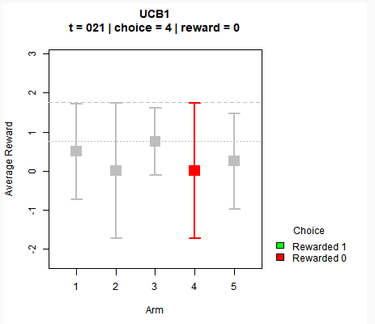
</p>

For each time step, we pick the arm that has the highest UCB value (estimated mean plus its confidence bound) and we try to observe the reward for that arm only. With each iteration, we update the return average of each arm through the equation:
- The mean of each arm `μ_i` increases with positive reward (1), and decreases with no reward (0)
- The confidence bound is updated by both `n` (number of overall time steps) and `n_i` (number of times we picked that arm). In the numerator, we observe the logarithmic time complexity where the boundary increases through `log(n)` with more passing time. With the denominator, we can see that the boundary decreases in linear time complexity with `n_i`.

The algorithm thus explore arms that might not be a good performer which we have high uncertainty about (thus a high UCB), while exploiting arms that have superior average returns but with high certainty.

# LinUCB (Disjoint)

In the paper ["A Contextual-Bandit Approach to Personalized News Article Recommendation"](https://arxiv.org/abs/1003.0146), Li et al. demonstrated the use of a contextual multi-armed bandit solution where the expected pay off `r_{t,a}` of an arm `a` is linear in its context covariates `x_{t,a}` at  time `t`. This is called Linear UCB Disjoint (LinUCB).

A simple example of this is demonstrated by his lecture slides by Assoc Prof Yue Yisong, which can be found [here](http://www.yisongyue.com/courses/cs159/lectures/LinUCB.pdf). In the example of a news article recommendation, there are two user groups with their corresponding context (young and old demographics) as shown by the relevant `x_1` (young) or `x_2` (old) feature vector. Based on the learnt weights `theta`, we can perform matrix multiplication to predict the pay off for the recommended article.

<div align="center">
    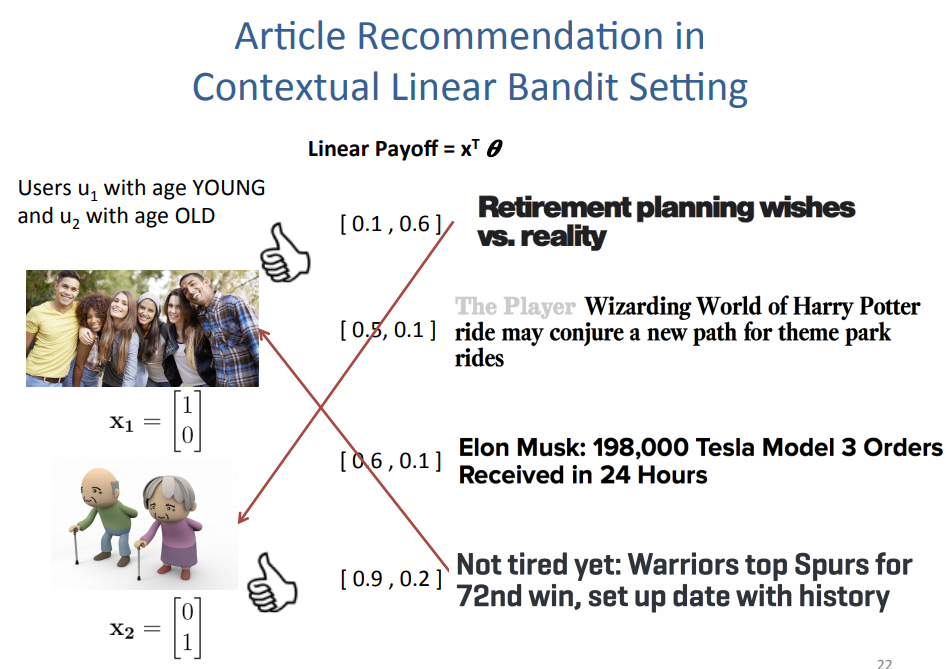
</div>

In matrix formulation, the above statement can be put forth as:

<div align="center">
    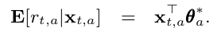
</div>

Simply put, think back about the use of a linear regression model where the response variable for each arm is a reward return based on the input covariates. The coefficients `θ*_a` is unknown but with the online learning algorithm, we perform ridge regression to obtain it at each time step.

<div align="center">
    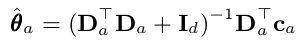
</div>

For simplication of the equation, we can rewrite the above using two variables `A_a` and `b_a`.

<div align="center">
    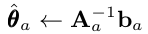
</div>

where  

<div align="center">
    
</div>

<div align="center">
    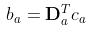
</div>

For more technical details, the ridge regression allows us to view the posterior distribution of the coefficients `p(θ_a)` as a Bayesian point estimate with as a Gaussian mean `θhat_a` and covariance `A_inv_a`. 

Building off that, for a given set of covariate inputs `x` at time `t`, the predicted expected reward return can be formulated as:
- Expected value 

<div align="center">
    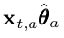
</div>

- Standard deviation

<div align="center">
    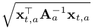
</div>

At the crux of the algorithm, we wish to find the arm with the highest UCB at time `t`. 

<div align="center">
    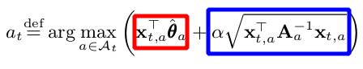
</div>

In similar form, this is once again represented by picking the arm based on the sum of :
- The mean reward estimate of each arm (red box) and 
- The corresponding upper confidence bound (blue box), where `α` is a hyper parameter 

The higher `α` is, the wider the confidence bounds become. Thus it results in a higher emphasis placed on exploration instead of exploitation. 

The above explanation captures most of the required intuition in the implementation of the LinUCB, while skipping certain technical details of it. Do refer to the actual paper for a deeper dive into it. 

# LinUCB Disjoint Implementation in Python

With that in mind, let's take a look at the overall algorithm.

<div align="center">
    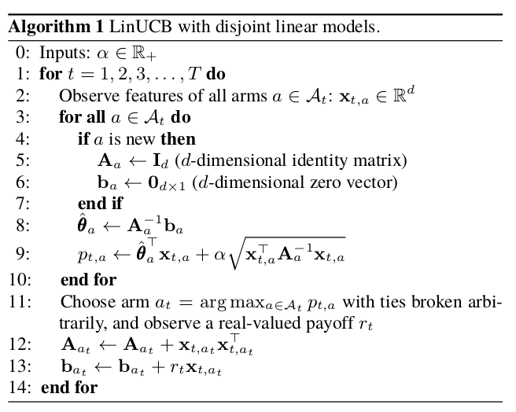
</div>

The algorithm can be broken down into the following phases for each time step `t` with the corresponding context vector `x_t`:
- If the arm is new, initiate `A_a` (d x d identity matrix) and `b_a` (d by 1 zero vector). d represents the dimensions of the covariates.
- Calculate `theta_a` using the ridge regression formula 
- Using `x_t`, calculate the UCB of each arm based on the sum of the expected mean and confidence bound (`alpha` * standard deviation)
- Out of all arms, select the arm that has the highest UCB. If there are arms that have the same UCB, randomly pick between them.
- Observe the reward based on the selected arm at time step `t`
- Update information only on `A_chosen_arm` and `b_chosen_arm` which represents the online training.

In summary, we need 3 objects for the simulation:
- Class object for each LinUCB disjoint arm
- Class object for the policy of K number of LinUCB disjoint arms
- Function for simulating the policy using a data set to determine the cumulative takeoff rate (ctr) using the LinUCB policy

For the data set, we will use the dataset from [here](http://www.cs.columbia.edu/~jebara/6998/dataset.txt). The data set represents the logged data of a policy for 10,000 lines of observed data for a total of 10 arms and 100 covariates. For each line (which represents a single time step):
- The first column represents the arm chosen (1 to 10)
- The 2nd column represents the reward function observed for the selected arm (0 or 1)
- The 3rd to last columns represent the 100 covariates

The trouble with simulation using a logged data set is that not all time steps will be useful. For example, for a given time step, if the LinUCB policy selects an arm that is not the same arm selected in the logged data, we cannot observe the reward function. Thus, the data for that time step is not relevant. 

To circumvent that, we only choose to observe the reward and perform online learning IF AND ONLY IF our policy selects the same arm as the logged data at that particular time step. Otherwise, we will move on to the next time step without any updates. Implicitly, this requires the assumption that the data points for the different time steps are independent of each other. For more details on this methodology of , please refer to the paper ["Unbiased Offline Evaluation of Contextual-bandit-based News Article Recommendation Algorithms"](https://arxiv.org/abs/1003.5956) by Li et al.

To implement the algorithm in Python code, we just need `numpy` for the matrix calculations. Along with each code chunk, I added comments to make it more understandable in terms of the algorithm.

Here is the Class object for a single LinUCB Disjoint Arm, which has 3 main methods:
- __Initiation__: Create `A` and `b` for that arm
- __UCB Calculation__: Using `x_t` context input at time t, we determine the estimate of `θhat`. Subsequently, we calculate the UCB.
- __Reward update__: Update information for that arm if it was chosen.

```{python}
# Create class object for a single linear ucb disjoint arm
class linucb_disjoint_arm():
    
    def __init__(self, arm_index, d, alpha):
        
        # Track arm index
        self.arm_index = arm_index
        
        # Keep track of alpha
        self.alpha = alpha
        
        # A: (d x d) matrix = D_a.T * D_a + I_d. 
        # The inverse of A is used in ridge regression 
        self.A = np.identity(d)
        
        # b: (d x 1) corresponding response vector. 
        # Equals to D_a.T * c_a in ridge regression formulation
        self.b = np.zeros([d,1])
        
    def calc_UCB(self, x_array):
        # Find A inverse for ridge regression
        A_inv = np.linalg.inv(self.A)
        
        # Perform ridge regression to obtain estimate of covariate coefficients theta
        # theta is (d x 1) dimension vector
        self.theta = np.dot(A_inv, self.b)
        
        # Reshape covariates input into (d x 1) shape vector
        x = x_array.reshape([-1,1])
        
        # Find ucb based on p formulation (mean + std_dev) 
        # p is (1 x 1) dimension vector
        p = np.dot(self.theta.T,x) +  self.alpha * np.sqrt(np.dot(x.T, np.dot(A_inv,x)))
        
        return p
    
    def reward_update(self, reward, x_array):
        # Reshape covariates input into (d x 1) shape vector
        x = x_array.reshape([-1,1])
        
        # Update A which is (d * d) matrix.
        self.A += np.dot(x, x.T)
        
        # Update b which is (d x 1) vector
        # reward is scalar
        self.b += reward * x
```

Here is the Class object for the LinUCB policy for K number of arms. It has two main methods:
- __Initiation__: Create a list of K `linucb_disjoint_arm` objects
- __Arm selection__: Choose arm based on the arm with the highest UCB for a given time step. 

```{python}
class linucb_policy():
    
    def __init__(self, K_arms, d, alpha):
        self.K_arms = K_arms
        self.linucb_arms = [linucb_disjoint_arm(arm_index = 1, d = d, alpha = alpha) for i in range(K_arms)]
        
    def select_arm(self, x_array):
        # Initiate ucb to be 0
        highest_ucb = -1
        
        # Track index of arms to be selected on if they have the max UCB.
        candidate_arms = []
        
        for arm_index in range(self.K_arms):
            # Calculate ucb based on each arm using current covariates at time t
            arm_ucb = self.linucb_arms[arm_index].calc_UCB(x_array)
            
            # If current arm is highest than current highest_ucb
            if arm_ucb > highest_ucb:
                
                # Set new max ucb
                highest_ucb = arm_ucb
                
                # Reset candidate_arms list with new entry based on current arm
                candidate_arms = [arm_index]

            # If there is a tie, append to candidate_arms
            if arm_ucb == highest_ucb:
                
                candidate_arms.append(arm_index)
        
        # Choose based on candidate_arms randomly (tie breaker)
        chosen_arm = np.random.choice(candidate_arms)
        
        return chosen_arm
```

Here is the function for ctr simulation using the `linucb_policy` object for a given data input. This function governs the update of the reward observation IF AND ONLY IF the selected arm by the policy object is equivalent to the arm of the logged data set for that particular time step. For time steps in which the above is true, I term them as "aligned time steps".

The function was designed to return the following:
- Count of aligned time steps
- Cumulative rewards
- Progression log of CTR during aligned time steps
- LinUCB policy object

```{python}
def ctr_simulator(K_arms, d, alpha, data_path):
    # Initiate policy
    linucb_policy_object = linucb_policy(K_arms = K_arms, d = d, alpha = alpha)
    
    # Instantiate trackers
    aligned_time_steps = 0
    cumulative_rewards = 0
    aligned_ctr = []
    unaligned_ctr = [] # for unaligned time steps
    
    # Open data
    with open(data_path, "r") as f:

        for line_data in f:

            # 1st column: Logged data arm. 
            # Integer data type
            data_arm = int(line_data.split()[0])

            # 2nd column: Logged data reward for logged chosen arm
            # Float data type
            data_reward = float(line_data.split()[1])

            # 3rd columns onwards: 100 covariates. Keep in array of dimensions (100,) with float data type
            covariate_string_list = line_data.split()[2:]
            data_x_array = np.array([float(covariate_elem) for covariate_elem in covariate_string_list])

            # For all arms in policy
            for i in range(linucb_policy_object.K_arms):

                # Find policy's chosen arm based on input covariates at current time step
                arm_index = linucb_policy_object.select_arm(data_x_array)

                # Check if arm_index is the same as data_arm (ie same actions were chosen)
                # Note that data_arms index range from 1 to 10 while policy arms index range from 0 to 9.
                if arm_index + 1 == data_arm:

                    # Use reward information for the chosen arm to update
                    linucb_policy_object.linucb_arms[arm_index].reward_update(data_reward, data_x_array)

                    # For CTR calculation
                    aligned_time_steps += 1
                    cumulative_rewards += data_reward
                    aligned_ctr.append(cumulative_rewards/aligned_time_steps)
                    
    return (aligned_time_steps, cumulative_rewards, aligned_ctr, linucb_policy_object)
```
# LinUCB Disjoint Policy with varying `alpha` values

We can now simulate the data to see how the LinUCB performs. For comparison, the benchmark will be based on a random showing of 10 arms of which the CTR will be around 10%. If there is no learning, the CTR will hover at the 10% mark. Based on the data, let's check out what happens when we specify `alpha` = 1.5. 

```{python}
alpha_input = 1.5
data_path = "../data/news_dataset.txt"
aligned_time_steps, cum_rewards, aligned_ctr, policy = ctr_simulator(K_arms = 10, d = 100, alpha = alpha_input, data_path = data_path)
```
<div align="center">
    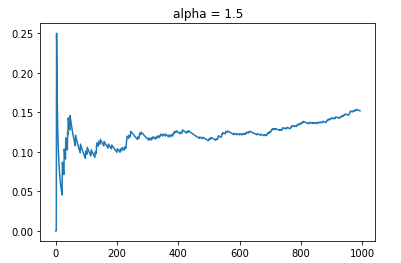
</div>

As depicted, the CTR starts off on average around 10%. As time progresses, the online learning kicks in that shows an increasing rate of CTR. By the end of the simulation, we observe that the data reaches around 15% CTR. One thing to also note is that out of 10,000 data steps, only about slightly less than 1000 was considered aligned.

Since `alpha` is a hyperparameter that pre-determines the emphasis of exploration versus exploitation, I will simulate the CTR of `alpha` = 1.0. This should result in a Policy that has less emphasis on exploring arms with higher uncertainty.

<div align="center">
    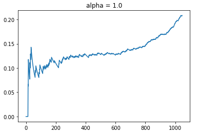
</div>

As usual, we see that the CTR starts off with around 10% but it increases moderately to the point around time step at 200. Between t = 200 to 600, we observe a plateau in terms of CTR. This is probably the point where the policy is exploring different arms that have similar uncertainty in terms of the UCB. After t = 600, it seems like the policy has evaluated the different arms sufficiently such that the mean estimate for each arm given the context information becomes precise with lower uncertainty. Thereafter, the CTR improves dramatically as the policy recommends the best arm for each context. With a lower `alpha`, we see that the CTR improves to the point where it ends at around 22%. Also that the total number of aligned time steps is about 50 more than what it was previously.

For the fun of it, let's test out what happens at `alpha` = 0.5.

<div align="center">
    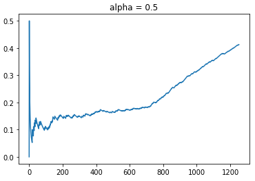
</div>

Based on an even lower weightage of exploration, we see that the new policy has a CTR that blows the previous observed CTRs out of the water. The maximum CTR reached is about 43%. Even with more aligned time steps, the policy was much more effective as shown by its CTR of 30% even at the comparable time step of t = 1000. Also observed is that we do observe a similar plateau in CTR growth rate from t = 200 to 700, where the policy is exploring different arms due to the similar levels of uncertainty. Once the policy learnt enough, the rewards rate shot up dramatically thereafter.

# Beyond LinUCB Disjoint

Coming to the end of this, I showed that the use of contextual bandits makes more sense if you have access to more granular information that might help predict the effectiveness of recommendations. LinUCB Disjoint is only one of many contextual bandit algorithms. The next variant of a linear contextual bandit is called LinUCB Hybrid which was also covered in the same paper ["A Contextual-Bandit Approach to Personalized News Article Recommendation"](https://arxiv.org/abs/1003.0146) by Li et al. 

<div align="center">
    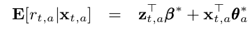
</div>

The hybrid model has an additional feature term `z_t`, which comprises of shared features across various arms. According to the paper, `z_t` is the feature of the current user/article combina-
tion while `β*` is an unknown coefficient vector common to all arms. I will not cover that in this article but I will probably do it in a separate article.

# Summary

In summary, I have illustrated the difference between multi-armed bandits and contextual bandits. Building off the concept of the UCB algorithm that is prevalent in the MAB realm, I illustrated the intuition behind the linear UCB contextual bandit, where the payoff is assumed to be a linear function of the context features. This was also done with a simulation experiment of a LinUCB policy with varying `alpha` values, and we observed the impact of the online learning.

The Jupyer notebook that has the relevant code for LinUCB Disjoint implementation can be found [here](https://github.com/kfoofw/bandit_simulations/blob/master/python/contextual_bandits/notebooks/LinUCB_disjoint.ipynb). For more details on MABs and CBs, please refer to my [Github project repo on bandit simulations](https://github.com/kfoofw/bandit_simulations).