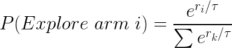
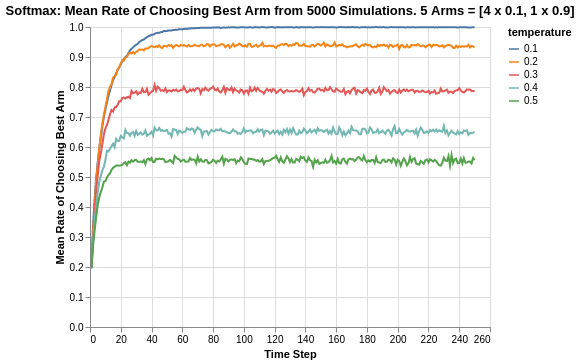
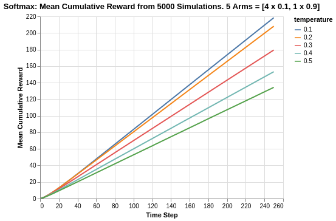
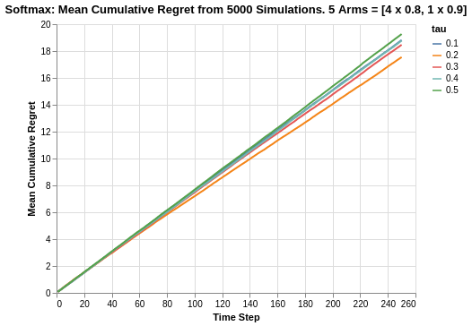

# Analysis of SoftMax Algorithm

Moving beyond the Epsilon Greedy algorithm, the Softmax algorithm provides further optimisation in terms of enhancing the chance of rewards during exploration.

To get a better intuition, consider the following two cases of 2 Bernoulli arms:
- The first arm has 0.1 reward average while the other has 0.9 reward average.
- The first arm has 0.1 reward average while the other has 0.11 reward average.

Using Epsilon Greedy in both cases, for a specified epsilon percentage of exploration trials, the algorithm will choose randomly between both arms in both situations regardless of how different the average rewards between both arms are.

Therein lies the opportunity for an optimized solution that the Softmax algorithm can provide. For any given round, instead of uniformly exploring all arms, it provides arms of different chance of being interacted with based on the difference in their current reward averages.

In summary, the Softmax proposes the following probability distribution of choosing each arm at each given round:

<p align="center">
    
</p>

where `r_i` represents the current reward return average of each arm at the current round. 

The `tau` parameter is a hyperparameter that ultimately determines how much randomisation. 
- When `tau` is large, the overall exponential element of all arms approach a resultant value of 1, and thus the chance of exploring any specific arm is 1.
- When `tau` is small, the overall exponential element of each arm is exponentially proportional to their current return, and thus, arms with higher average return will have a higher chance of being chosen in the exploration phase.

It is important to note that the structured exploration of the Softmax algorithm combines aspects of exploitation and exploration. Instead of segmenting the trials into exploration and exploitation phases, the Softmax incorporates exploitation by using it to increase the chance of picking the higher return arm, while also yet making it also possible to pick the lower return arm (which is some form of exploration).

The following analysis is based on the book ["Bandit Algorithms for Website Optimization"](https://www.oreilly.com/library/view/bandit-algorithms-for/9781449341565/) by John Myles White. For further understanding of the code, I have included comments for easier understanding.

Below is the code for creation of the SoftMax algorithm setup and progressive updates of counts and values for arms.
- Counts: Represent recorded times when arm was pulled.
- Values: Represent the known mean reward. In the case of a Bernoulli arm, values represent the probability of reward which ranges from 0 to 1.

```
import math
import random

# Arm selection based on Softmax probability
def categorical_draw(probs):
    z = random.random()
    cum_prob = 0.0
    
    for i in range(len(probs)):
        prob = probs[i]
        cum_prob += prob
        
        if cum_prob > z:
            return i
    return len(probs) - 1

# Softmax algorithm
class Softmax:
    def __init__(self, tau, counts, values):
        self.tau = tau
        self.counts = counts # Count represent counts of pulls for each arm. For multiple arms, this will be a list of counts.
        self.values = values # Value represent average reward for specific arm. For multiple arms, this will be a list of values.
        return
    
    # Initialise k number of arms
    def initialize(self, n_arms):
        self.counts = [0 for col in range(n_arms)]
        self.values = [0.0 for col in range(n_arms)]
        return
    
    def select_arm(self):
        # Calculate Softmax probabilities based on each round
        z = sum([math.exp(v / self.tau) for v in self.values])
        probs = [math.exp(v / self.tau) / z for v in self.values]
        
        # Use categorical_draw to pick arm
        return categorical_draw(probs)
    
    # Choose to update chosen arm and reward
    def update(self, chosen_arm, reward):
        # update counts pulled for chosen arm
        self.counts[chosen_arm] = self.counts[chosen_arm] + 1
        n = self.counts[chosen_arm]
        
        # Update average/mean value/reward for chosen arm
        value = self.values[chosen_arm]
        new_value = ((n - 1) / float(n)) * value + (1 / float(n)) * reward
        self.values[chosen_arm] = new_value
        return
```

As per previous discussion in the Epsilon Greedy article, we will use a Bernoulli distribution to represent the reward function of each arm.

```
class BernoulliArm():
    def __init__(self, p):
        self.p = p
    
    # Reward system based on Bernoulli
    def draw(self):
        if random.random() > self.p:
            return 0.0
        else:
            return 1.0
```
To proceed with any further analysis, an operational script is required to process the simulation. The following code helps to create a simulation for a specific run of epsilon value.
- num_sims: Represents the number of independent simulations, each of length equal to 'horizon'.
- horizon: Represents the number of time steps/trials per round of simulation

```
def test_algorithm(algo, arms, num_sims, horizon):
    
    # Initialise variables for duration of accumulated simulation (num_sims * horizon_per_simulation)
    chosen_arms = [0.0 for i in range(num_sims * horizon)]
    rewards = [0.0 for i in range(num_sims * horizon)]
    cumulative_rewards = [0 for i in range(num_sims * horizon)]
    sim_nums = [0.0 for i in range(num_sims *horizon)]
    times = [0.0 for i in range (num_sims*horizon)]
    
    for sim in range(num_sims):
        sim = sim + 1
        algo.initialize(len(arms))
        
        for t in range(horizon):
            t = t + 1
            index = (sim -1) * horizon + t -1
            sim_nums[index] = sim
            times[index] = t
            
            # Selection of best arm and engaging it
            chosen_arm = algo.select_arm()
            chosen_arms[index] = chosen_arm
            
            # Engage chosen Bernoulli Arm and obtain reward info
            reward = arms[chosen_arm].draw()
            rewards[index] = reward
            
            if t ==1:
                cumulative_rewards[index] = reward
            else:
                cumulative_rewards[index] = cumulative_rewards[index-1] + reward
                
            algo.update(chosen_arm, reward)
    
    return [sim_nums, times, chosen_arms, rewards, cumulative_rewards]
```
## Simulation of Arms with relatively big differences in Means
Similar to what was done previously in the analysis for Epsilon-greedy, the simulation comprises of the following:  
- Create 5 arms, four of which have average reward of 0.1, and the last/best has average reward of 0.9.
- Save simulation output to a tab-separated file
- Create 5000 independent simulations for each `tau` value for a total of 5 epsilon values ranging from 0.1 to 0.5.

The choice for 5000 independent simulations is because we want to determine the average performance. Each simulation might be subject to the stochastic nature/run and the performances might be skewed due to random chance. Thus it is important to run a reasonably high number of simulations to evaluate the average mean/performance.

```
import random

random.seed(1)
# out of 5 arms, 1 arm is clearly the best
means = [0.1, 0.1, 0.1, 0.1, 0.9]
n_arms = len(means)
# Shuffling arms
random.shuffle(means)

# Create list of Bernoulli Arms with Reward Information
arms = list(map(lambda mu: BernoulliArm(mu), means))
print("Best arm is " + str(np.argmax(means)))

f = open("standard_results_soft.tsv", "w+")

# Create simulations for each tau/temperature value
for tau in [0.1, 0.2, 0.3, 0.4, 0.5]:
    algo = SoftMax(tau, [], [])
    algo.initialize(n_arms)
    results = test_algorithm(algo, arms, 5000, 250)
    
    # Store data
    for i in range(len(results[0])):
        f.write(str(epsilon) + "\t")
        f.write("\t".join([str(results[j][i]) for j in range(len(results))]) + "\n")
f.close()
```
Using some data-preprocessing and basic Altair visualisation, we can plot the probability of pulling the best arm for each epsilon value.

<p align="center">

</p>

For different values of `tau`, there are different asymptotic limits to the eventual rate of chooosing the best arm. As mentioned previously, the higher the value of `tau`, the higher degree of randomisation in picking arms which explains the asymptotes. For a `tau` value of 0.1, it does seem to eventually converge close to 1.

The rate of convergence towards their corresponding asymptotes seem to be similar for all values of `tau`, except for 0.1 which seems to take about twice as long as the rest. From an inverted perspective of reaching convergence, it seems that there is some manner of exponential decay towards the asymptote as shown by the nearly similar gradients at the start (from time steps between 0 to 10).

<p align="center">

</p>

Looking at the cumulative reward system, there is a stark difference of the Softmax algorithm compared to the Epsilon Greedy algorithm. We saw that for the Epsilon Greedy algorithm simulation, the `epsilon` value of 0.1 had to play catchup since it was not exploring enough in the early stage of the experiment to discover the best arm. Thus, its cumulative return was below that of other `epsilon` values for a large portion of the 250 time steps period.

For the Softmax algorithm, we see that its algorithm provides sufficient exploration amidst exploitation. Thus, lower values of `tau` remained constantly higher in terms of cumulative reward. This is intuitive as the lower the value of `tau`, the lower the degree of randomised exploration. Thus, there is a lower degree of picking poorer return arms.

It must also be noted that for Epsilon Greedy, the cumulative reward values ranged between 140 to 180. In this case, Softmax `tau` values of 0.1 and 0.2 are able to reach cumulative reward range of 200 to 220, which means they constantly exploited the best arm and did so quite early on.

## Simulation of Arms with relatively smaller differences in Means

The previous analysis was a simulation exercise on arms with big differences in reward returns. We extend the analysis to a situation where the arms are relatively closer.

In the following case, we simulate 5 arms, 4 of which have a mean of 0.8 while the last/best has a mean of 0.9.

<p align="center">

</p>

With the reward returns of arms being much closer now, we see a big deterioration in the performance of the Softmax algorithm. The rate of choosing the best arm now ranges between 0.22 to 0.32. It is interesting to observe that a `tau` value of 0.2 has an asymptote of 0.32, while a `tau` value of 0.1 has an asymptote of 0.25 (which is similar to that of `tau` value 0.4). 

This seems to imply that the reduced difference in reward function makes it harder to determine which is the best arm especially with respect to `tau` value 0.1. In fact, for a higher degree of randomisation represented by a higher `tau` value 0.2 (or even 0.3), we obtain better rates of selecting the best arm.

It should be noted that in this scenario, for Epsilon Greedy algorithm, the rate of choosing the best arm is actually higher as represented by the ranges of 0.5 to 0.7, compared to the Softmax algorithm range of 0.22 to 0.32. This seems to imply that Epsilon Greedy might be better suited for multi-armed based situations where the difference in means are much smaller.

<p align="center">

</p>

Similar to what we saw in the Epsilon Greedy analysis, the cumulative rewards for all `tau` values are much closer in nature so much so that they are indistinguishable. Likewise, this is probably due to the fact that the reward means of all arms are quite close.

Since the arms are close in average returns, it will be more interesting to verify the overall cumulative regret.

<p align="center">

</p>

Based on the cumulative regret plots, we see that `tau` value of 0.2 is the best at around 15.5 while `tau` value of 0.5 is the worst at 19.2. On a whole, the Softmax algorithm is worst off compared to the Epsilon Greedy algorithm which had a range of 12.3 to 14.8. For the better performing `tau` values, there is a tapering off in the plots but as a whole, the Softmax algorithm does seem to fare worser than Epsilon Greedy.

## Summary
In this analysis of Softmax algorithm, we covered the algorithmic intuition as well as the experimental results of applying the Softmax algorithm. The results were benchmarked against the Epsilon Greedy algorithm which was covered previously.

A learning takeaway is that for arms with closer means, the Softmax algorithm does not seem to be as robust in terms of determining the best arm, for which Epsilon Greedy is more suitable. 